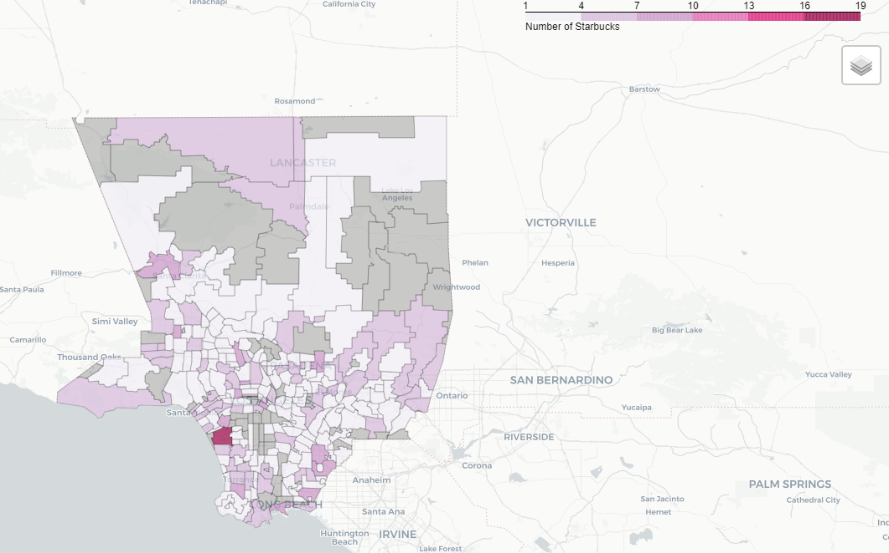
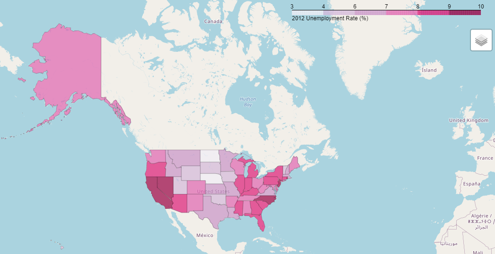
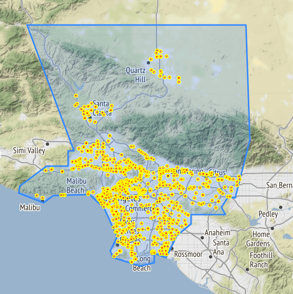

# Developing Interactive Maps with Folium
This repo uses a Python library called [Folium](https://python-visualization.github.io/folium/), which builds on a common web mapping javascript library called [Leaflet](https://leafletjs.com/).

This repo contains both a colab notebook and python script that quickly and easily generates two interactive maps that identify Starbucks locations in Los Angeles County, CA and a chloropleth map of the United States that shows the unemployment rate as a percent of population.

The purpose of working through this tutorial is to improve skills in developing interactive open source content while additionally inproving skills using Pandas. Folium provides an advantage to geospatial programmers proficient in Python because it makes visualiztion simple and effective in addition to providing many tileset options. Mapbox, OpenStreetMap,a nd Stamen are offered as the primary tilesets, which enables users to create truly custom products. Folium also promotes the use of images, videos, GeoJSONs, and TopoJSON overlays making it a highly versatile platform. I would like to play around with the tool more to try creating raster or satellite imagery based interactive products with vector overlays of solar field locations or wildfire locations.

The first product develops a chloropleth map that depcits Starbucks locations within zip codes. It should look like this.

The second product generates a map showing precise indivudual locations as points within Los Angeles, County, CA. It should look similar to this.

The final product develops the United States Chloropleth of Unemployment rate (as a percent of population). It should be similar to this.

# Citation
This tutorial is based on [this Medium Tutorial by Ritvik Kharkar](https://towardsdatascience.com/making-3-easy-maps-with-python-fb7dfb1036) and the associated [Github repo for his tutorial](https://github.com/ritvikmath/StarbucksStoreScraping). I've updated deprecated Folium code; re-orderd some of the steps to explain how his use of zip codes as a geography, while well intentioned and executed, is a huge conceptual problem; and added a brief follow-up showing a solid use of administrative units for choropleth maps.
